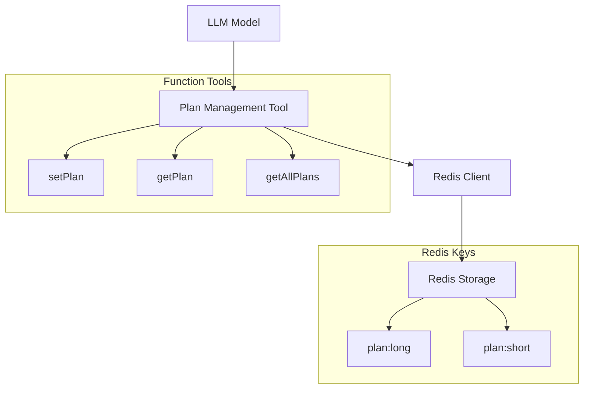

# Design Document: Plan Management Tool

## Overview

计划管理工具是一个简单而高效的 LLM Function Tool，用于管理悠酱角色的长期计划和短期计划。该工具提供基本的计划设置、更新和查询功能，计划数据以字符串形式存储在 Redis 中，确保数据持久化和跨会话访问。

## Architecture

### 系统架构图



### 模块职责

- **Plan Management Tool**: 核心工具模块，提供计划管理的所有功能
- **Redis Client**: 数据访问层，处理与 Redis 的连接和数据操作
- **Function Interface**: LLM 函数接口，定义可被 AI 模型调用的结构化函数

## Components and Interfaces

### 核心组件

#### 1. Plan Management Tool (`planManagementTool.ts`)

```typescript
interface PlanManagementTool {
  setPlan(type: 'long' | 'short', content: string): Promise<boolean>;
  getPlan(type: 'long' | 'short'): Promise<string | null>;
  getAllPlans(): Promise<{ longTerm: string | null; shortTerm: string | null }>;
}
```

#### 2. Redis 存储接口

使用 `ioredis` 进行 Redis 操作：

```typescript
import Redis from 'ioredis';

interface PlanStorage {
  redis: Redis;
  set(key: string, value: string): Promise<boolean>;
  get(key: string): Promise<string | null>;
  del(key: string): Promise<boolean>;
}
```

### LLM Function Tool 定义

根据 Vercel AI SDK 的规范，使用 `tool` 函数定义工具：

```typescript
import { tool } from 'ai';
import { z } from 'zod';

const setPlanTool = tool({
  description: '设置或更新长期计划或短期计划。如果内容为空字符串则清空该计划。',
  parameters: z.object({
    type: z.enum(['long', 'short']).describe('计划类型：long（长期计划）或 short（短期计划）'),
    content: z.string().describe('计划内容，如果为空字符串则清空该计划')
  }),
  execute: async ({ type, content }) => {
    // 实现计划设置逻辑
    return { success: true, type, content };
  }
});

const getPlanTool = tool({
  description: '获取指定类型的计划内容',
  parameters: z.object({
    type: z.enum(['long', 'short']).describe('计划类型：long（长期计划）或 short（短期计划）')
  }),
  execute: async ({ type }) => {
    // 实现计划查询逻辑
    return { type, content: '...' };
  }
});

const getAllPlansTool = tool({
  description: '获取所有计划（长期和短期）',
  parameters: z.object({}),
  execute: async () => {
    // 实现查询所有计划逻辑
    return { longTerm: '...', shortTerm: '...' };
  }
});
```

## Data Models

### 计划数据结构

由于计划只是简单的字符串，数据模型非常简单：

```typescript
// Redis 存储格式
type PlanData = string;

// 函数返回格式
interface AllPlansResponse {
  longTerm: string | null;
  shortTerm: string | null;
}

// Redis Key 常量
const REDIS_KEYS = {
  LONG_TERM_PLAN: 'plan:long',
  SHORT_TERM_PLAN: 'plan:short'
} as const;
```

### 数据流

1. **设置计划**: LLM → setPlan() → Redis SET
2. **查询单个计划**: LLM → getPlan() → Redis GET → 返回字符串
3. **查询所有计划**: LLM → getAllPlans() → Redis MGET → 返回对象

## Error Handling

### 错误类型和处理策略

1. **Redis 连接错误**
   - 捕获连接异常
   - 返回友好错误信息
   - 不中断主流程

2. **数据格式错误**
   - 验证输入参数
   - 返回具体的验证错误信息

3. **函数调用错误**
   - 使用 try-catch 包装所有异步操作
   - 记录错误日志
   - 返回标准化错误响应

```typescript
interface ToolResponse<T = any> {
  success: boolean;
  data?: T;
  error?: string;
}
```

## Correctness Properties

*A property is a characteristic or behavior that should hold true across all valid executions of a system-essentially, a formal statement about what the system should do. Properties serve as the bridge between human-readable specifications and machine-verifiable correctness guarantees.*

### Property 1: Plan Storage Round Trip
*For any* plan type (long or short) and any plan content string, setting a plan and then immediately getting that plan should return the same content and store it in the correct Redis key.
**Validates: Requirements 1.1, 1.2, 2.1, 2.2, 3.1, 3.2**

### Property 2: Plan Update Replacement
*For any* plan type and any two different plan content strings, setting a plan with the first content, then updating it with the second content, should result in only the second content being stored.
**Validates: Requirements 1.3**

### Property 3: Empty Plan Clearing
*For any* plan type, setting a plan with empty string content should result in that plan being cleared (returning null or empty string on subsequent queries).
**Validates: Requirements 1.4**

### Property 4: All Plans Query Consistency
*For any* combination of long-term and short-term plan contents, after setting both plans, querying all plans should return both contents in the correct structure.
**Validates: Requirements 2.3**

### Property 5: Data Persistence Without TTL
*For any* plan content stored in Redis, the data should not have an expiration time set (TTL should be -1).
**Validates: Requirements 3.3**

### Property 6: Error Handling Robustness
*For any* error condition (Redis connection failure, invalid parameters, etc.), the tool should return a structured error response without throwing unhandled exceptions.
**Validates: Requirements 3.4, 4.4**

### Property 7: Function Interface Compliance
*For any* valid function call parameters, the tool should accept them according to the defined LLM Function Tool schema and return properly formatted responses.
**Validates: Requirements 4.1, 4.2**